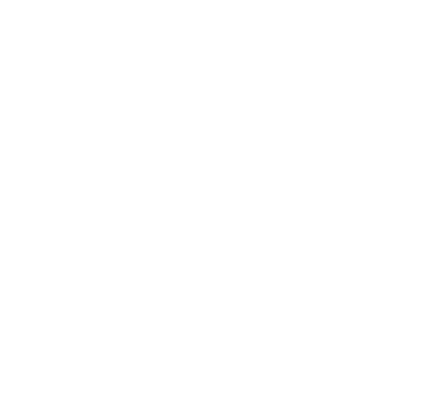

   
  <b>👋🏼 I'm Martin, an open-minded developer from Germany interested in all things modding.</b> 
  💻 I've created many Minecraft Java mods for the Fabric, Quilt, Forge and Neoforge modloaders, as well as a few projects with other programming/scripting languages, such as JavaScript, HTML and CSS.  
  🐧 As an Arch Linux user, I value the benefits of free and open-source software. Therefore, all of my projects are licensed under open-source licenses.
    
  
   
  🥳 Find out more on my new <a href="https://midnightdust.eu/">website</a>!

