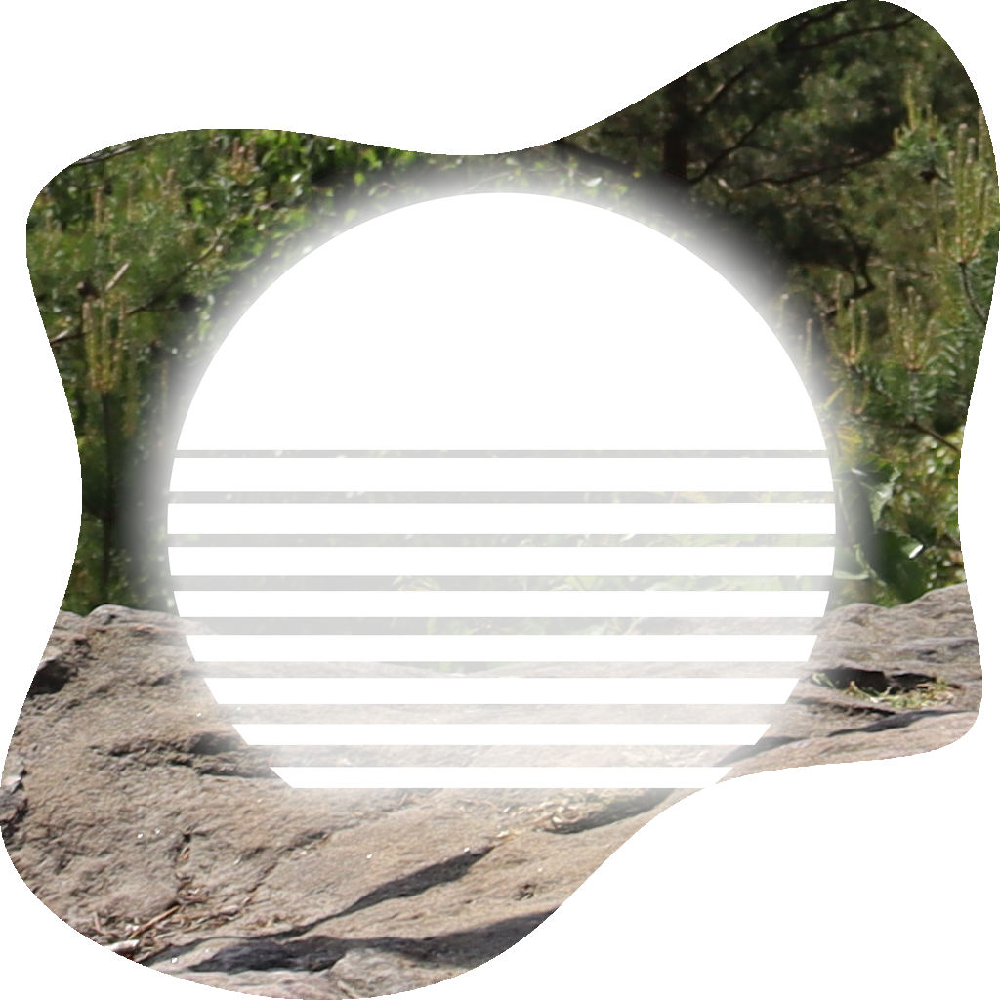

   
  <b>👋🏼 I'm Martin, an open-minded developer from Germany interested in all things modding.</b> 
  ⛏️ I've created many Minecraft Java mods for the Fabric, Quilt, Forge and Neoforge modloaders (see <a href="https://github.com/TeamMidnightDust">MidnightDust</a>). 
  💻 In addition, I have experience working with Python and C++, as well as doing general Web Development.  
  🐧 As an Arch Linux user, I value the benefits of free and open-source software, so all of my projects are open-source as well :)
    
    
    
  🌐 𝙵𝚒𝚗𝚍 𝚘𝚞𝚝 𝚖𝚘𝚛𝚎 𝚘𝚗: <a font href="https://midnightdust.eu/">𝚖𝚒𝚍𝚗𝚒𝚐𝚑𝚝𝚍𝚞𝚜𝚝.𝚎𝚞</a> 🌐

